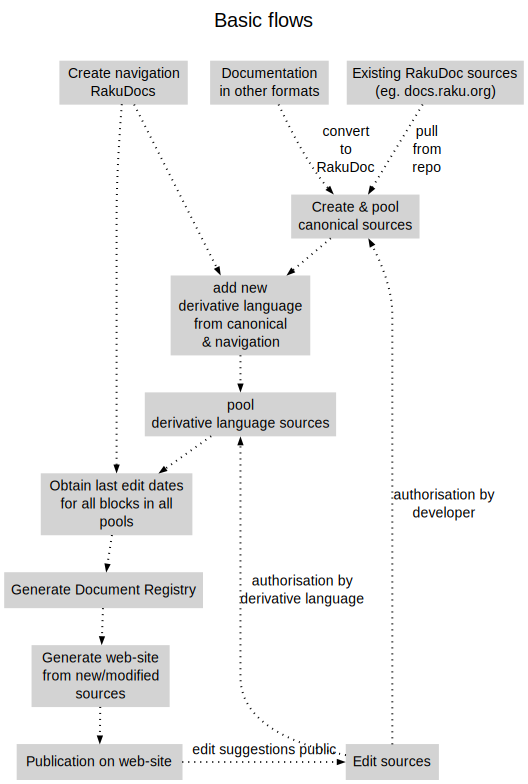

# Design for elucid8

----

## Table of Contents

<a href="#Introduction">Introduction</a>   
<a href="#Workflow">Workflow</a>   
<a href="#Flow_diagram">Flow diagram</a>   

## Introduction
This is a description of the design of the **elucid8 explanation framework**. It is currently a work in progress and the API described here will change. [Link back to README](README.md) 

## Workflow
There will be several separate workflows, which will be included in the diagram below. In addition, there will be several entry-points. But for the time being the following is a first approximation: 

## Flow diagram

----

----

Rendered from docs/Design.rakudoc/Design at 10:45 UTC on 2024-12-20

Source last modified at 10:44 UTC on 2024-12-20

