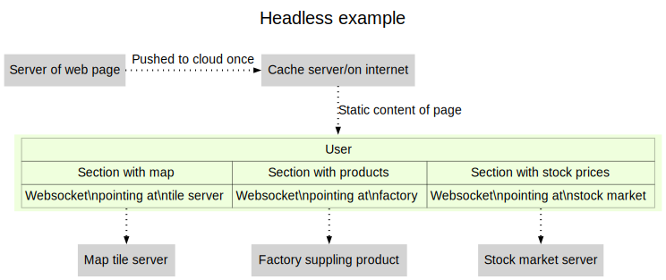

# Design for elucid8

----

## Table of Contents

<a href="#Introduction">Introduction</a>   
<a href="#Workflow">Workflow</a>   
&nbsp;&nbsp;- <a href="#Framework_flow_diagram">Framework flow diagram</a>   
<a href="#Website_deployment">Website deployment</a>   
&nbsp;&nbsp;- <a href="#Dynamic_site">Dynamic site</a>   
&nbsp;&nbsp;- <a href="#Headless_page_with_micro-services">Headless page with micro-services</a>   
<a href="#Navigation_and_information">Navigation and information</a>   


<div id="Introduction"></div>

## Introduction
<span class="para" id="6c96b2c"></span>This is a description of the design of the **elucid8 explanation framework**. It is currently a work in progress and the API described here will change. [Link back to README](README.md) 

<div id="Workflow"></div>

## Workflow
<span class="para" id="7c74ec9"></span>There will be several separate workflows, which will be included in the diagram below. In addition, there will be several entry-points. But for the time being the following is a first approximation: 


<div id="Framework flow diagram"></div><div id="Framework_flow_diagram"></div>

## Framework flow diagram

<div id="Website deployment"></div><div id="Website_deployment"></div>

## Website deployment
<span class="para" id="ebeb85d"></span>The aim is to create a website that consists of cachable pages, but still allows for user interaction. 

<span class="para" id="8f5d2bf"></span>When web servers provided the whole web page, web sites tended to be considered either static or dynamic. 

<span class="para" id="5ff3fb6"></span>Most web sites will involve interaction with the user, for example, authentication, or updating information. A common mechanism for interaction is to create each page on a host server with a new page generated depending on user interaction. These were called *dynamic* web sites. 

<span class="para" id="23aef73"></span>The approach can be illustrated as follows: 


<div id="Dynamic site"></div><div id="Dynamic_site"></div>

## Dynamic site


<span class="para" id="93e852d"></span>Although dynamic websites allow for user interaction, there are three disadvantages 


&nbsp;&nbsp;❎ A host site is needed for the server and the database  
&nbsp;&nbsp;❎ Requesting page fragments and data requests complicates the server logic  
&nbsp;&nbsp;❎ If most of the webpage is unchanged, it could be cached, thus increasing the response speed for the user  

<span class="para" id="964a3cd"></span>After the development of interactive elements such as web sockets, a web page can be created that contains javascript libraries and named ` <div> ` elements such that data can be drawn from arbitrary data sources not located on the host that published the web page. Consequently, the entire page can be cached. 

<span class="para" id="846101b"></span>Consider a web page that shows a map using tiles taken from a map provider, market information from a stock market, and product information from a supplier. This can be illustrated as follows: 


<div id="Headless page with micro-services"></div><div id="Headless_page_with_micro-services"></div>

## Headless page with micro-services


<span class="para" id="a8c3f49"></span>The advantages of this approach are 


&nbsp;&nbsp;✅ The web page first sent out is static and not changed unless text is modified  
&nbsp;&nbsp;✅ Cached data is rendered faster  
&nbsp;&nbsp;✅ Multiple data sources can be included  
&nbsp;&nbsp;✅ Each source of information will focus on authentication separately  
&nbsp;&nbsp;✅ <span class="para" id="b8894c5"></span>Even if the *product supplier* is the author of the web page, only the product data server needs to be authenticated, and can be developed separately 

  
&nbsp;&nbsp;✅ Page content and data base security are separated  


<div id="Navigation and information"></div><div id="Navigation_and_information"></div>

## Navigation and information
<span class="para" id="279a05d"></span>The aim is for the language of the menus and user controls (the UI or User Interface or Navigation) to be changeable without changing the language of the content, and vice versa. 

<span class="para" id="480fa30"></span>This means that: 


&nbsp;&nbsp;🌍 the translation of each item of the navigation needs to be included/or available in each page of content  
&nbsp;&nbsp;🌍 <span class="para" id="fa02b98"></span>since [plugins](Plugin policy) may provide UI information, there needs to be an interface for possible translations so that a new derivative set can be made. 

  
&nbsp;&nbsp;🌍 In addition to text elements, localisation requires changes in the presentation of time, currency, etc.  
<span class="para" id="59d7e0c"></span>Some standarisation is needed for defining languages, both navigation and content. 


&nbsp;&nbsp;🌍 Languages will be denoted using the ISO 639 2-letter codes  
&nbsp;&nbsp;🌍 Alternative words/spellings may be supplied using ISO 3166-1 2-letter codes  
<span class="para" id="f45ea30"></span>The following is the first approach: 


&nbsp;&nbsp;🌍 All UI will be provided by plugins  
&nbsp;&nbsp;🌍 <span class="para" id="657489e"></span>Templates for user-facing UI content may only contain `ui-token`s. 

  
&nbsp;&nbsp;🌍 <span class="para" id="6e785b5"></span>A `ui-token` must be unique across the web-site, so typically plugins will append their names to the token name. 

  
&nbsp;&nbsp;🌍 <span class="para" id="5e6146a"></span>A `ui-token` is either a string, or a callable that evaluates to a string. 

  
&nbsp;&nbsp;🌍 <span class="para" id="4354301"></span>Plugins will generate a hash called `ui-tokens` with the structure `2-letter -> TOKEN -> 'string'`, for example, 


```
    ui-tokens => %(
        en => %(
           COL => 'colour',
           MENU => 'Menu',
           SEARCH => 'Search',
           MODIFIED => -> $mod-inst { sprintf( "Modified at %02d:%02d on %s", .hour, .minute, .dd-mm-yyyy) with $mod-inst.DateTime }
       ),
       en-US %(
           COL => 'color',
           MODIFIED => -> $mod-inst { sprintf( "Modified at %02d:%02d on %s", .hour, .minute, .mm-dd-yyyy) with $mod-inst.DateTime }
       ),
       cy => %(
           COL => 'lliw',
           MENU => 'Menw',
           SEARCH => 'Chwilia',
       ),
   ),
```  
&nbsp;&nbsp;🌍 <span class="para" id="a9f1f3b"></span>When a `ui-token` is missing in a derived language is missing, the `ui-token` in the canonical language is used. 

  
&nbsp;&nbsp;🌍 <span class="para" id="2828cce"></span>When a `ui-token` in a regional variant is missing, it is replaced by the `ui-token` in the two-letter hash of the derived language


----

----

Rendered from /docs/Design.rakudoc/Design at 12:50 UTC on 2024-12-22

Source last modified at 12:50 UTC on 2024-12-22

